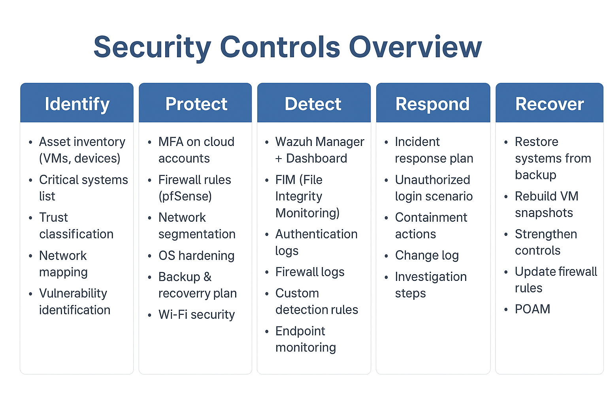

# LakeTown Digital Fortress - Home SOC & Lab Environment

## Network Architecture
This network map shows a segmented environment with firewall protection, VLAN-based separation, core services, and secure access designed using defense-in-depth principles.

## Environment Breakdown
- **Firewall / Gateway:** pfSense managing the WAN/LAN interfaces and NAT rules.
- **SIEM / Detection:** Wazuh agent-manager infrastructure monitoring endpoints.
- **Operating Systems:** Windows Server, Ubuntu, Windows 11 Pro.
- **Security Assessment Tools:** Kali Linux, Parrot OS, and isolated PenTesting targets.

## Hypervisor & Virtualization Architecture
This lab is built using a nested virtualization design inside Oracle VirtualBox. It maps how the physical host allocates networks across an isolated environment to safely handle security testing and centralized monitoring.

### Network Segmentation Breakdown
* **Internal Network:** Hosts the primary target environment, including a Windows workspace monitored by Wazuh and a Kali Linux attack box.
* **DMZ (Demilitarized Zone):** Isolates the standalone vulnerable machine ("Basic Pentesting VM") to mimic a public-facing network vector.
* **Host-Only Network:** Secures the Wazuh Manager infrastructure, ensuring telemetry and log forwarding happen over a dedicated management backplane.

## Security Controls & Visibility Matrix
To ensure comprehensive logging and monitoring across the lab environment, a Visibility Matrix was established. This maps out how detection telemetry is collected and what security bounds are placed on each asset.

### Control Details
* **Log Aggregation:** Centralized telemetry collection via the Wazuh Manager over secure channels.
* **Network Enforcements:** Traffic inspection, logging, and network segregation handled entirely by the pfSense firewall core.
* **Asset Categorization:** Differentiation between fully monitored internal assets (Ubuntu VM) and intentional monitoring blindspots or external elements (Kali Linux).

## NIST Cybersecurity Framework (CSF) Alignment
The infrastructure and operational policies of the LakeTown Digital Fortress are designed to map directly against the core pillars of the NIST Cybersecurity Framework (CSF).

### Framework Implementation Details
* **Identify:** Managed via comprehensive network mapping, active asset inventory tracking, and vulnerability scans.
* **Protect:** Enforced using multi-factor authentication (MFA), strict pfSense firewall policies, network segmentation, and OS hardening protocols.
* **Detect:** Powered by the centralized Wazuh SIEM manager, file integrity monitoring (FIM), custom detection logic, and continuous log analysis.
* **Respond:** Defined by an active incident response containment process targeting unauthorized logins and anomalous events.
* **Recover:** Supported by configuration change logs, snapshot baselines, and structured system backup/recovery procedures.
