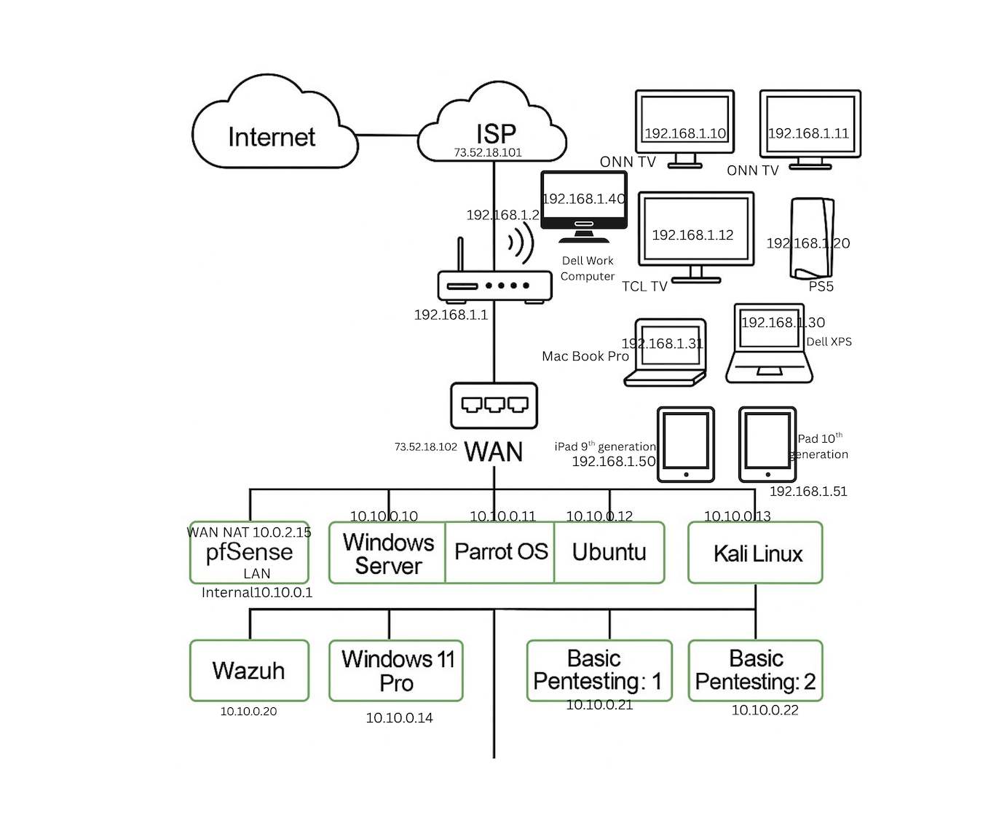

# LakeTown Digital Fortress - Home SOC & Lab Environment

## Network Architecture
This network map shows a segmented environment with firewall protection, VLAN-based separation, core services, and secure access designed using defense-in-depth principles.

## Environment Breakdown
- **Firewall / Gateway:** pfSense managing the WAN/LAN interfaces and NAT rules.
- **SIEM / Detection:** Wazuh agent-manager infrastructure monitoring endpoints.
- **Operating Systems:** Windows Server, Ubuntu, Windows 11 Pro.
- **Security Assessment Tools:** Kali Linux, Parrot OS, and isolated PenTesting targets.
