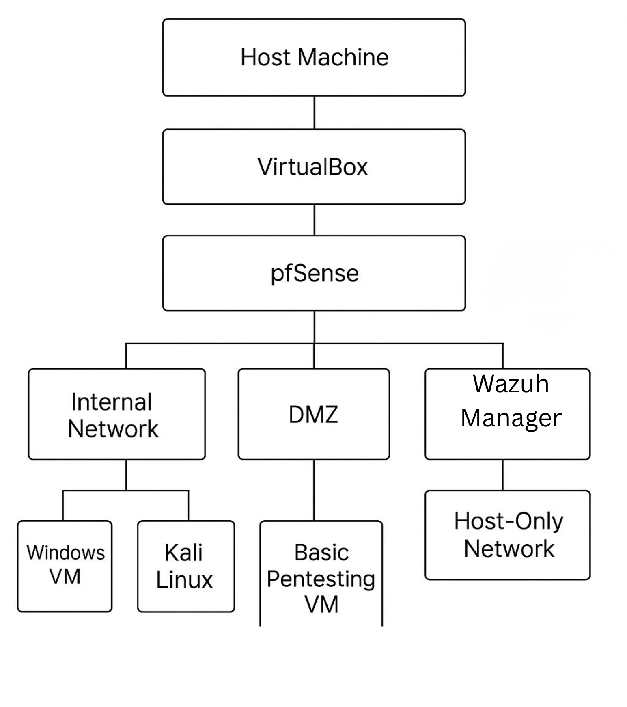

# LakeTown Digital Fortress - Home SOC & Lab Environment

## Network Architecture
This network map shows a segmented environment with firewall protection, VLAN-based separation, core services, and secure access designed using defense-in-depth principles.

## Environment Breakdown
- **Firewall / Gateway:** pfSense managing the WAN/LAN interfaces and NAT rules. 
- **SIEM / Detection:** Wazuh agent-manager infrastructure monitoring endpoints. 
- **Operating Systems:** Windows Server, Ubuntu, Windows 11 Pro.
- **Security Assessment Tools:** Kali Linux, Parrot OS, and isolated PenTesting targets.

## Hypervisor & Virtualization Architecture
This lab is built using a nested virtualization design inside Oracle VirtualBox. It maps how the physical host allocates networks across an isolated environment to safely handle security testing and centralized monitoring.

### Network Segmentation Breakdown
* **Internal Network:** Hosts the primary target environment, including a Windows workspace monitored by Wazuh and a Kali Linux attack box.
* **DMZ (Demilitarized Zone):** Isolates the standalone vulnerable machine ("Basic Pentesting VM") to mimic a public-facing network vector.
* **Host-Only Network:** Secures the administration interface for host management.
